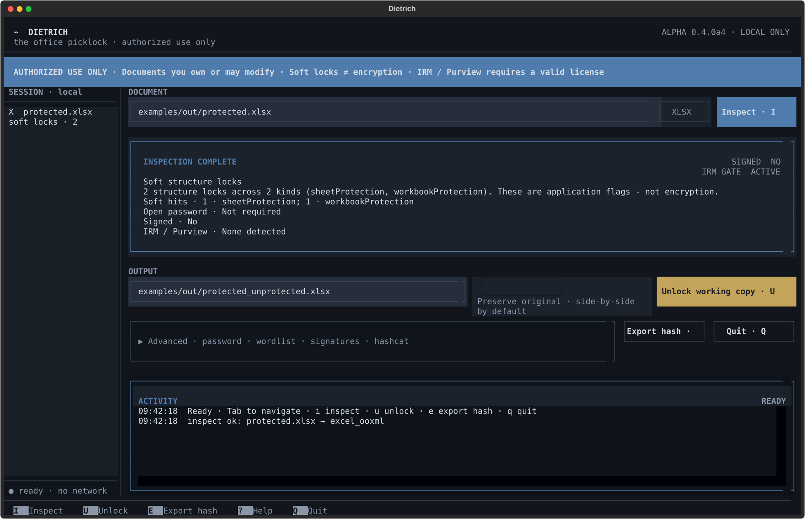

# Dietrich

Dietrich is a local command-line application for inspecting document protection,
removing non-cryptographic protection, and recovering open passwords on documents
that you own or are authorized to modify. It supports Microsoft Office formats and
PDF. An optional Textual interface exposes the same operations in a terminal.

Version 0.4.0a4 is an alpha release. Command behavior, Python APIs, and output
formats may change before a stable release.



[Open the static interface demo](https://sebastianspicker.github.io/dietrich/).
The demo uses sanitized fixture data, cannot access local files, and marks all
command-capable actions as simulated.

## Purpose and scope

Dietrich distinguishes between two protection layers:

- Soft protection consists of editable document flags such as worksheet, workbook,
  document, presentation, and PDF permission restrictions.
- Open-password encryption requires a password or an offline recovery method before
  the file can be read.

The application works on local files. It does not provide a service, network API,
database, browser interface, or rights-management license acquisition.

## Current capabilities

| Input | Supported operations |
|---|---|
| `.xlsx`, `.xlsm` | Inspect and remove worksheet, chartsheet, workbook, and package-property protection |
| `.docx`, `.docm` | Inspect and remove document, write, and package-property protection |
| `.pptx`, `.pptm` | Inspect and remove modification verifiers and package-property protection |
| Encrypted Office files | Verify explicit passwords, search wordlists or masks, run bounded brute force, export hashes, or invoke a local `hashcat` executable |
| `.xls`, `.doc`, `.ppt` | Inspect and patch recognized legacy binary protection records without changing stream lengths |
| PDF | Inspect encryption and permissions, recover a user password, and write an unencrypted copy |
| Signed OOXML | Reject by default, or create an unsigned copy with `--strip-signatures` |

Additional options cover worksheet-only changes, preservation of selected
verifiers, VBA project verifier clearing, JSON inspection output, and experimental
OOXML mutation files for local compatibility research.

## Limitations

- Microsoft Purview, Azure RMS, and other IRM-protected files are detected and
  rejected. Dietrich does not obtain or bypass use licenses.
- Legacy binary support recognizes known records and uses equal-length stream
  patches. It is not a general CFBF editor.
- VBA verifier clearing is best effort and does not decrypt VBA source code.
- Native PDF hash export supports the Standard security handler for revisions 2
  through 6 when the required fields are present.
- Re-signing is an experimental RSA/SHA-256 OOXML subset. It does not implement
  the complete Office transform, timestamp, trust, or compatibility model.
- Dietrich does not verify documents by opening them in Microsoft Office, LibreOffice,
  or third-party PDF viewers.

See [docs/ALPHA.md](docs/ALPHA.md) for the detailed support matrix.

## Requirements

- Python 3.11 or later. CI covers Python 3.11, 3.12, and 3.13.
- `msoffcrypto-tool` for encrypted Office files.
- `pikepdf` for PDF operations.
- `olefile` for legacy binary Office files.
- `cryptography` for re-signing.
- `textual` for the terminal interface.
- A separate `hashcat` executable on `PATH` when using `--hashcat`.

## Installation

Create a virtual environment and install from the repository:

```bash
python3 -m venv .venv
source .venv/bin/activate
python -m pip install -e '.[full]'
```

Install only the features you need by replacing `full` with one or more of
`crypto`, `pdf`, `research`, `sign`, or `ui`.

For development:

```bash
python -m pip install -e '.[full,dev]'
```

The repository does not define a PyPI publication workflow. These instructions
cover installation from a source checkout.

## Configuration

Dietrich has no application configuration file and defines no application
environment variables. Operations are configured with command-line flags or the
terminal interface.

By default, an unlock command writes `NAME_unprotected.EXT` next to the input.
Existing output files are rejected unless `--force` is supplied. Password search
is bounded by `--max-candidates`, which defaults to 5,000,000 candidates.

Run `dietrich --help` for the complete option list.

## Usage

Inspect a document without writing an output:

```bash
dietrich report.xlsx --inspect
dietrich report.xlsx --inspect --json
```

Remove supported soft protection:

```bash
dietrich report.xlsx
dietrich report.xlsx --output report_editable.xlsx
dietrich report.xlsx --worksheets-only
```

Supply or search for an open password:

```bash
dietrich secret.xlsx --password 'known-password'
dietrich secret.xlsx --wordlist passwords.txt
dietrich secret.xlsx --mask 'Office-?d?d?d?d'
dietrich secret.xlsx --brute --charset digits --max-length 4
```

Export a hash or invoke a local hashcat process:

```bash
dietrich secret.xlsx --export-hash hashcat
dietrich secret.xlsx --hashcat --wordlist passwords.txt
```

Signed OOXML packages fail closed. To remove signature parts and create an
unsigned working copy:

```bash
dietrich signed.xlsx --strip-signatures --output unsigned.xlsx
```

Start the terminal interface:

```bash
dietrich --tui
dietrich-tui report.xlsx
```

The TUI uses `i` for inspection, `u` for unlock, `e` for hash export, `?` for
help, and `q` to quit. Its recent-file list exists only for the current process.

The public Python API exports `inspect_document`, `unlock_document`,
`inspect_workbook`, `unlock_workbook`, and `export_document_hash`:

```python
from pathlib import Path

from dietrich import inspect_document, unlock_document

report = inspect_document(Path("report.xlsx"))
result = unlock_document(Path("report.xlsx"), Path("report_editable.xlsx"))
```

## Repository structure

| Path | Contents |
|---|---|
| `src/dietrich/cli.py` | CLI parsing, output, and exit codes |
| `src/dietrich/dispatch.py` | Format classification and operation routing |
| `src/dietrich/ooxml/` | OOXML inspection and rewriting |
| `src/dietrich/crypto/` | Password recovery, hash export, hashcat, and IRM detection |
| `src/dietrich/legacy/` | Legacy Office record inspection and patching |
| `src/dietrich/pdf/` | PDF inspection and permission removal |
| `src/dietrich/signatures/` | OOXML signature stripping and experimental re-signing |
| `src/dietrich/safety/` | Archive validation and output publication |
| `src/dietrich/tui/` | Textual interface and packaged styles |
| `tests/unit/` | Isolated component tests |
| `tests/integration/` | Cross-component format, CLI, and TUI tests |
| `tests/regression/` | Safety and compatibility regression tests |
| `tests/e2e/` | Subprocess command-entry-point tests |
| `tests/support/` | Shared fixture builders and process helpers |
| `tests/fixtures/` | Tracked public Office fixtures and provenance |
| `examples/` | Local sample-file builder and command walkthrough |
| `scripts/` | Documentation capture script |
| `docs/` | Capability, strategy, research, and capture references |

Focused references:

- [Capability status](docs/ALPHA.md)
- [Processing strategy](docs/STRATEGIES.md)
- [Terminal interface](docs/TUI.md)
- [Release and distribution](docs/RELEASE.md)

## Development workflow

Keep format logic below `dispatch.py`; the CLI and TUI should translate user
input into the same operation calls. Add focused tests for a changed format and a
subprocess test when changing CLI behavior.

Create local sample files and run the command walkthrough with:

```bash
python examples/generate_samples.py
bash examples/run_demos.sh
```

See [CONTRIBUTING.md](CONTRIBUTING.md) for coding and review requirements.

## Testing

Run the repository checks from the project root:

```bash
ruff check src tests scripts examples
pytest -q
pytest -m e2e -q
python scripts/capture_screenshots.py --check
```

CI installs `.[dev,full]` and runs Ruff, the complete pytest suite, and the
capture check on Ubuntu with Python 3.11 through 3.13.

## Deployment and operation

Dietrich is operated as a local Python package. The repository contains no server
deployment, container definition, hosted runtime, or publication job. The
Hatchling configuration in `pyproject.toml` defines editable and wheel packaging,
including the Textual style files.

Work on copies of important documents. Successful output publication uses a
temporary file and refuses replacement unless `--force` is explicit.

## Troubleshooting

Exit codes are:

| Code | Meaning |
|---|---|
| 0 | Operation completed |
| 1 | Password search exhausted without a match |
| 2 | Invalid arguments, unsupported input, unsafe archive, output collision, or another operation error |
| 3 | A required optional dependency is not installed |

Common failures:

- `Missing optional dependency`: install the relevant project extra.
- Output already exists: choose another `--output` path or use `--force` after
  confirming replacement is safe.
- `hashcat` is unavailable: install it separately and confirm `hashcat` resolves
  on `PATH`.
- IRM detection: open the document with an account that has a valid use license.
  Dietrich cannot process it.
- Unsafe archive rejection: inspect the input for duplicate, encrypted, oversized,
  or excessively compressed ZIP entries. Dietrich does not bypass these checks.

## Security considerations

Use Dietrich only on authorized documents. Password lists, exported hashes,
decrypted outputs, unsigned copies, certificates, and private keys are sensitive
files. Restrict their permissions and remove temporary material when it is no
longer required.

Stripping signatures removes authenticity evidence. Re-signing does not establish
trust by itself. Validate important output with the intended document application
before relying on it.

Archive processing rejects more than 10,000 members, members over 64 MiB, total
uncompressed content over 512 MiB, compression ratios over 100:1, duplicate
entries, and encrypted entries.

See [SECURITY.md](SECURITY.md) for vulnerability reporting guidance.

## License

Dietrich is licensed under the [MIT License](LICENSE).
