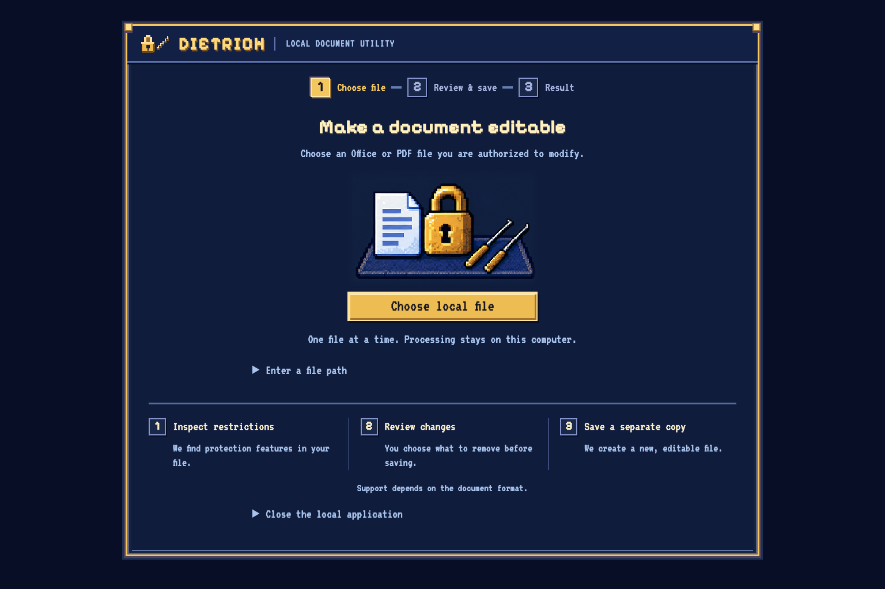
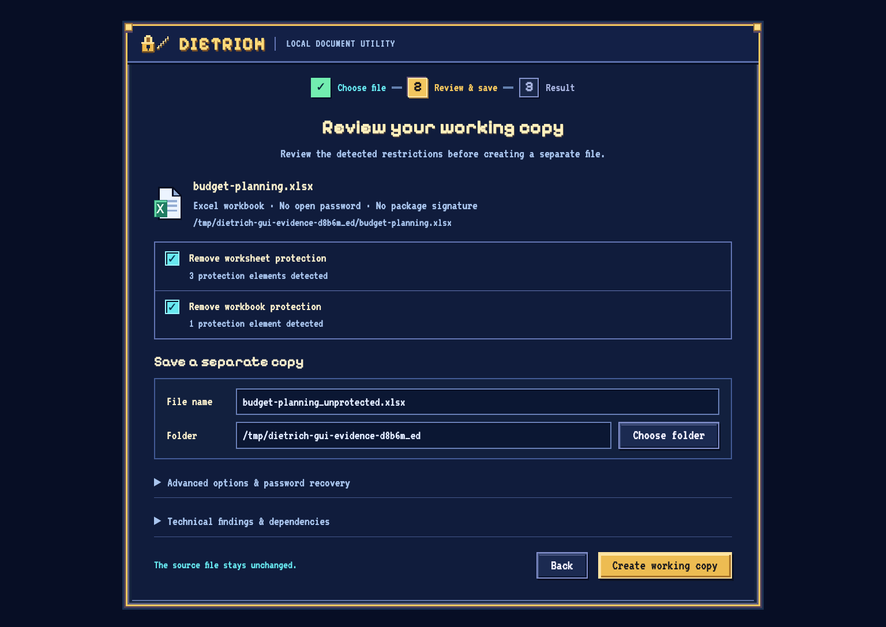
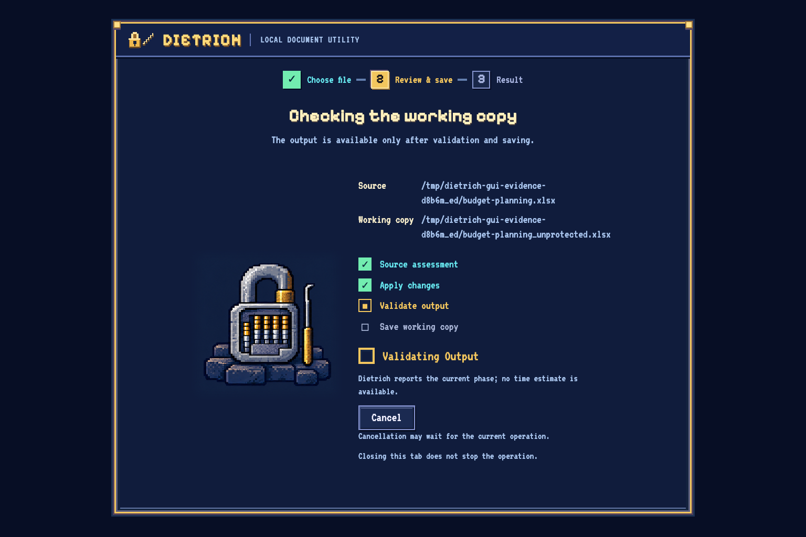
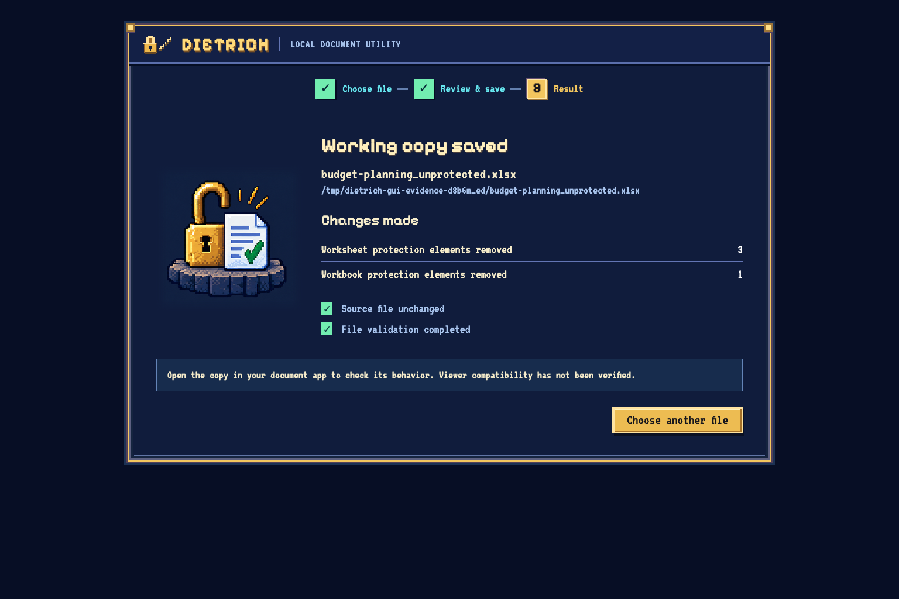

# Dietrich

**The office picklock.**

Dietrich is a local Python tool for documents you own or are authorized to
modify. It inspects protection in Microsoft Office and PDF files, removes
supported non-cryptographic restrictions, and recovers open passwords — all
without sending your files anywhere.

[](https://github.com/sebastianspicker/dietrich/actions/workflows/ci.yml)
[](LICENSE)
[](https://www.python.org/downloads/)
[](docs/ALPHA.md)

You get a command-line interface, a local graphical interface, an optional
Textual terminal interface, and a small Python API.

> **0.4.0a5 is an alpha release.** Commands, Python APIs, and output formats can
> still change before a stable release.

## Screenshot tour

The graphical interface walks through four steps and runs the same Python
operations as the CLI. Every document stays on your machine.

| | |
| --- | --- |
|  |  |
| **1 · Choose a file** — pick a local Office or PDF document. | **2 · Review restrictions** — choose what to remove and where to save. |
|  |  |
| **3 · Validate and save** — the copy is reopened and checked before publication. | **4 · Read the result** — removal counts, warnings, and the saved path. |

The interface adapts to narrow screens too —
[390&nbsp;px review capture](site/screenshots/05-review-mobile.png).

Want to click through without installing anything? The
[Instrument Workbench demo](https://sebastianspicker.github.io/dietrich/) is a
static, fixture-only simulation of the terminal interface. It cannot select,
upload, inspect, or change files, and it never runs Dietrich.

## What Dietrich does

- Inspects OOXML, encrypted Office, legacy binary Office, and PDF inputs.
- Removes supported worksheet, workbook, document, presentation, and PDF
  permission restrictions.
- Verifies passwords, runs bounded local candidate searches, exports recovery
  hashes, or drives a separately installed `hashcat`.
- Refuses rights-managed input and signed OOXML by default.
- Creates a validated side-by-side working copy and leaves the source untouched.

Support varies by format. Legacy `.ppt` mutation is unavailable, VBA verifier
clearing and OOXML re-signing are experimental, and Dietrich does not acquire IRM
licenses or verify how output looks in Microsoft Office, LibreOffice, or
third-party PDF viewers. The [capability matrix](docs/ALPHA.md) lists exact
coverage.

## Requirements

- Python 3.11 or later. CI covers 3.11, 3.12, and 3.13 on Ubuntu.
- Optional Python dependencies for the features you use:
  `msoffcrypto-tool`, `pikepdf`, `olefile`, `cryptography`, and `textual`.
- A separately installed `hashcat` executable on `PATH` for `--hashcat`.

## Install

From a checkout, create a virtual environment and install the extras you need:

```bash
python3 -m venv .venv
source .venv/bin/activate
python -m pip install -e '.[full]'
```

Swap `full` for one or more of `crypto`, `pdf`, `legacy`, `sign`, or `ui` to
install only selected features. There is no PyPI package yet.

## Command line

Inspect a file without writing anything:

```bash
dietrich report.xlsx --inspect
dietrich report.xlsx --inspect --json
```

Create an editable working copy:

```bash
dietrich report.xlsx
dietrich report.xlsx --output report_editable.xlsx
dietrich report.xlsx --worksheets-only
```

Output defaults to `NAME_unprotected.EXT` beside the input. An existing target
is rejected unless you pass `--force`.

Supply or search for an open password:

```bash
dietrich secret.xlsx --password 'known-password'
dietrich secret.xlsx --wordlist passwords.txt
dietrich secret.xlsx --mask 'Office-?d?d?d?d'
dietrich secret.xlsx --brute --charset digits --max-length 4
```

Candidate searches default to a ceiling of 5,000,000. Export a hash, or hand the
job to a local `hashcat`:

```bash
dietrich secret.xlsx --export-hash hashcat
dietrich secret.xlsx --hashcat --wordlist passwords.txt
```

Signed OOXML packages are refused by default. Stripping signatures produces an
unsigned copy:

```bash
dietrich signed.xlsx --strip-signatures --output unsigned.xlsx
```

Run `dietrich --help` for every option.

## Graphical interface

```bash
dietrich-gui
dietrich-gui report.xlsx
```

The local browser interface guides you through choosing a document, reviewing
its restrictions, creating a separate working copy, and reading the validated
result. Advanced controls cover password recovery, signature handling, VBA,
re-signing, and hash export. Nothing is uploaded to a remote service.

The launcher opens a session URL on `127.0.0.1`. Keep that URL private — it
grants access to the local session. Use `--no-browser` to open it yourself, and
press Ctrl+C in the launching terminal to stop after active-operation cleanup.
Closing the tab does not stop the Python process. See the
[graphical interface guide](docs/GUI.md) for details.

## Terminal interface

Install the `ui` or `full` extra, then run:

```bash
dietrich --tui
dietrich-tui report.xlsx
```

The TUI calls the same application operations as the CLI, and its recent-path
list lives only for the current process. Keyboard commands: `i` inspect, `u`
unlock, `e` export a hash, `Escape` cancel, `?` help, and `q` quit after cleanup.
See the [terminal interface guide](docs/TUI.md) for details.

## Python API

The supported top-level functions are `inspect_document`, `unlock_document`,
`inspect_workbook`, `unlock_workbook`, and `export_document_hash`.

```python
from pathlib import Path

from dietrich import inspect_document, unlock_document

report = inspect_document(Path("report.xlsx"))
result = unlock_document(Path("report.xlsx"), Path("report_editable.xlsx"))
```

All five functions accept an optional keyword-only `control=OperationControl()`.
Use a fresh control for each operation. Another thread can call `control.cancel()`
and poll its `phase` and `cancellation_requested` properties. An accepted request
raises `OperationCancelledError` before publication; once publication begins,
`cancel()` returns `False` and the caller waits for the result. Native calls
finish before cancellation takes effect. Both types are exported from `dietrich`.

Internal format modules are not compatibility facades.

## How it stays local and safe

Dietrich has no remote service, database, or persistent state. It works on one
document at a time and publishes a new file rather than editing the original.

- Output defaults to a new sibling path, and `--force` is required to replace an
  existing target.
- Successful publication validates an unpublished candidate, writes a
  mode-`0600` temporary file, and performs one atomic replace.
- ZIP input is bounded: 10,000 members, 64 MiB per member, 512 MiB total, and a
  100:1 compression ratio. Duplicate and encrypted entries are rejected.
- The graphical interface serves a bundled frontend from an authenticated
  loopback session; it has no upload route and no general file download.

Read [SECURITY.md](SECURITY.md) for the full trust model.

## Repository map

| Path | Purpose |
| --- | --- |
| `src/dietrich/domain/` | Typed assessments and unpublished artifact records |
| `src/dietrich/application/` | Assessment, recovery, hash-export, and make-editable use cases |
| `src/dietrich/ooxml/` | OOXML inspection, encryption, signatures, and candidate writing |
| `src/dietrich/pdf/` | PDF inspection, recovery, hash export, and candidate writing |
| `src/dietrich/legacy/` | Verified legacy Office inspection and equal-length transforms |
| `src/dietrich/crypto/` | Bounded password candidates and local hashcat integration |
| `src/dietrich/safety/` | Bounded container access and the sole artifact transaction |
| `src/dietrich/tui/` | Optional Textual adapter and packaged styles |
| `src/dietrich/gui/` | Local graphical adapter and bundled browser assets |
| `site/` | Separately deployable static mock-data simulation |
| `tests/` | Behavioral, safety, architecture, and interface contracts |

The [architecture guide](docs/ARCHITECTURE.md) is the source of truth for
component ownership, dependency direction, runtime flows, and safety invariants.

## Development

Install the locked development environment. The `demo` group carries the
Playwright runtime that `pyright` and the browser/demo tests need:

```bash
uv sync --locked --all-extras --group demo
```

Run the repository gate from the root:

```bash
uv lock --check --offline
uv run ruff check src tests examples scripts site/tests
uv run ruff format --check src tests examples scripts site/tests
uv run pyright
uv run pytest -q --tb=short
```

The release gate also builds source and wheel distributions offline. See
[CONTRIBUTING.md](CONTRIBUTING.md) for change requirements and
[docs/RELEASE.md](docs/RELEASE.md) for distribution and Pages deployment.

## Troubleshooting

| Exit code | Meaning |
| ---: | --- |
| 0 | Operation completed |
| 1 | Password search exhausted without a match |
| 2 | Invalid arguments, unsupported or unsafe input, an output collision, or another operation error |
| 3 | A required optional dependency is not installed |

- Missing optional dependency? Install the matching project extra.
- `hashcat` not found? Install it separately and confirm it is on `PATH`.
- Output collision? Choose another path, or use `--force` after checking the
  target.
- IRM-protected input needs a valid license in an authorized application, so
  Dietrich cannot process it.
- Unsafe archives are rejected rather than processed with relaxed limits.

## Security and research

Work on copies of important documents. Decrypted output, unsigned copies,
password lists, exported hashes, certificates, and private keys are all
sensitive. Trust boundaries and vulnerability reporting live in
[SECURITY.md](SECURITY.md).

Focused notes cover [legacy binary Office](docs/research/LEGACY_BINARY.md),
[OOXML signatures](docs/research/SIGNATURES.md), and
[OOXML mutation research](docs/research/VIEWER_ROBUSTNESS.md).

## License

Dietrich is licensed under the [MIT License](LICENSE).
