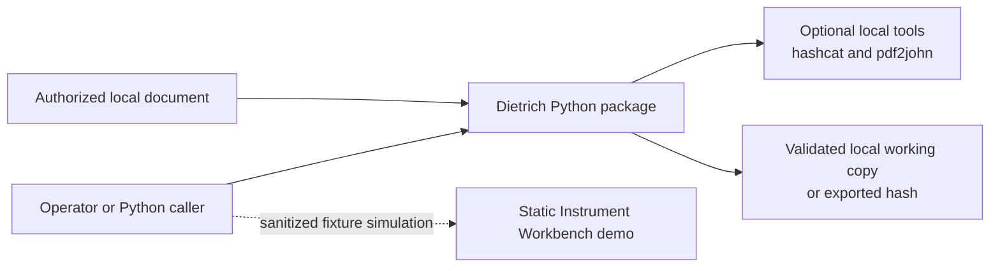
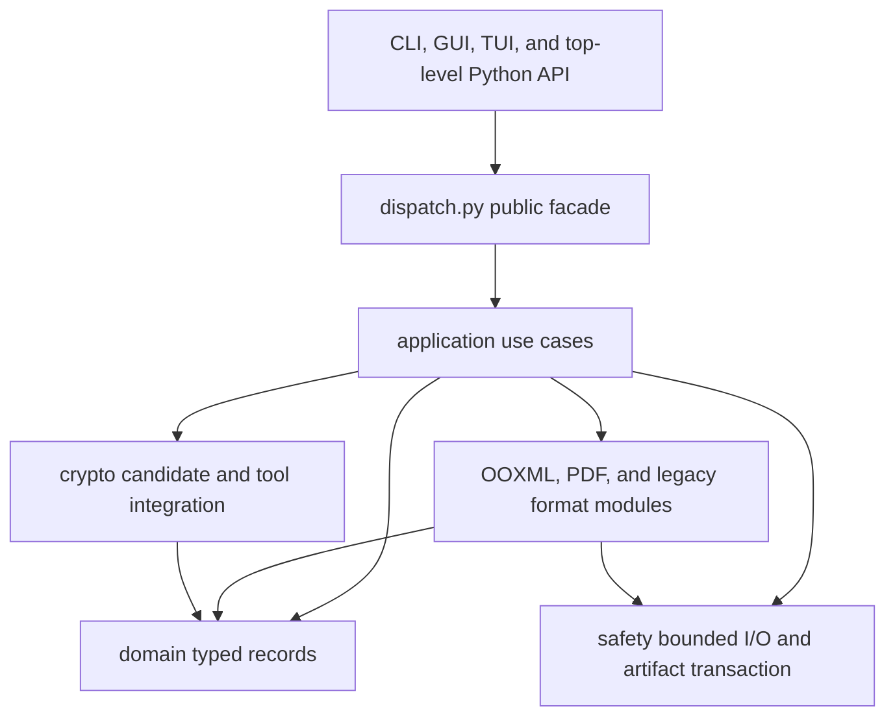

# Architecture

Dietrich is one local Python distribution. It exposes a CLI, a local graphical
interface, an optional Textual interface, and a small public API. It assesses
untrusted Office and PDF input and can produce one validated, editable working
copy. The repository also ships a static browser simulation that never calls the
Python application.

Read this document for component ownership, dependency direction, runtime flows,
and safety invariants. Exact format coverage lives in [ALPHA.md](ALPHA.md), and
user-facing interface details live in [GUI.md](GUI.md) and [TUI.md](TUI.md).

## System context

There is no persistent service, remote API, database, account system, or
on-disk application state. The graphical adapter starts a session-authenticated
HTTP server bound only to `127.0.0.1`, and its browser assets ship with the
package. The TUI and graphical interface keep recent paths in memory only. The
static demo has no runtime connection to Dietrich, to local files, or to
external services.

## Components and dependency direction

| Component | Responsibility |
| --- | --- |
| `domain/` | Pure assessment facts, capabilities, blockers, results, and unpublished `CandidateArtifact` records |
| `application/` | Complete use-case sequencing for assessment, password resolution, hash export, and editable-copy creation |
| `dispatch.py` | Stable public-function facade used by interaction adapters |
| `operation.py` | Thread-safe cancellation, phase polling, and serialized publication entry |
| `ooxml/` | ZIP package identity, XML transforms, Office encryption, signatures, and validated candidate writing |
| `pdf/` | PDF inspection, password and hash handling, permissions, and validated candidate writing |
| `legacy/` | Bounded CFB access, verified BIFF/FIB transforms, and fail-closed PowerPoint inspection |
| `crypto/` | Bounded password candidates and controlled local hashcat execution |
| `safety/` | Bounded ZIP and CFB access, plus the sole final-publication transaction |
| `cli.py`, `tui/`, `gui/` | Input collection and presentation, with no document policy |
| `research/` | Experimental local OOXML mutation generator behind its own `dietrich-research` entry point, isolated from the document command |

The intended dependency direction is adapters → public facade and application →
format modules → domain and safety. Architecture tests reject forbidden imports,
including CLI and TUI access to implementation packages (both adapters are now
part of the enforced dependency matrix), multiple publication owners, and format
writers that inspect final targets.

## Public compatibility boundary

The supported Python boundary is the five functions exported from `dietrich`:
`inspect_document`, `unlock_document`, `inspect_workbook`, `unlock_workbook`, and
`export_document_hash`, together with their exported value and error types. The
exported types include the assessment vocabulary returned on
`DocumentInspection` — `ProtectionLayer`, `Capability`, `CapabilityCode`,
`Blocker`, and `BlockerCode` — so callers can annotate and match against the enum
classes rather than raw strings. The four console entry points (`dietrich`,
`dietrich-tui`, `dietrich-gui`, and the separate lab-only `dietrich-research`),
CLI flags and exit codes, documented JSON and result fields, file formats, and
default output naming are observable contracts too. Internal format functions are
not compatibility facades.

All five functions accept an optional keyword-only `control=None`. Callers can
pass a fresh `OperationControl` and catch `OperationCancelledError`; existing
positional arguments and result fields are unchanged.

## Assessment flow

`application.assess.assess_document` is the single inspection path shared by the
CLI, TUI, Python facade, and other use cases. It classifies the input as PDF,
OOXML, encrypted Office, legacy binary Office, or unknown, applies the IRM gate,
and returns a `DocumentInspection` with typed capabilities and blockers.

Every application use case enforces those blockers before routing to a format
backend or external tool. Presentation code reads typed results instead of
repeating format probes or parsing human-readable notes.

## Editable-copy transaction

`application.make_editable.make_editable_copy` owns the entire output-producing
flow:

1. Create a private transaction workspace and snapshot the source once.
2. Assess the snapshot and reject rights-managed or unsupported input.
3. Resolve an open password and decrypt when necessary.
4. Ask one format module to write an unpublished candidate.
5. Require the writer to validate that candidate.
6. Optionally re-sign and validate a second unpublished OOXML candidate.
7. Validate the final candidate by its concrete artifact kind.
8. Copy it to an adjacent private file and publish exactly once.

Format writers receive source and candidate paths and return a
`CandidateArtifact`. They never choose the final target, decide overwrite
policy, or publish. `ArtifactTransaction` creates a mode-`0600` temporary file
beside the target and completes one atomic replace. A failure before publication
leaves an absent target absent and an existing target unchanged.

`CandidateArtifact.document_format` always describes the concrete output. Its
optional internal `result_document_format` records input provenance: decrypted
Office output keeps its Excel, Word, PowerPoint, or legacy identity for
validation, while public results continue to report `ENCRYPTED_OOXML`. Optional
re-signing preserves that provenance.

Only registered input snapshots can reuse successful ZIP metadata checks, and
only while their file identity and timestamps remain unchanged. Signed-package
policy is enforced on every use. Every new candidate receives fresh metadata and
identity validation. Writer validation and final-publication validation each
read all ZIP members fully for CRC verification; neither pass is skipped.

One publication owner is deliberate. Earlier independent writers could publish
an unsigned output before later signing failed. Centralizing publication gives
every format the same validation, permissions, cleanup, collision, and failure
contract without introducing a general repository or unit-of-work abstraction.
The accepted decision is recorded in
[0001: One artifact transaction owns publication](decisions/0001-single-artifact-transaction.md).

## Format and trust boundaries

- OOXML identity requires exactly one defining main part, checked again before
  publication against the candidate's declared format.
- OOXML validation rejects unsafe names, duplicate aliases, encrypted entries,
  excessive expansion, ambiguous main parts, and signed packages unless
  stripping is explicit.
- Bounded CFB handling limits input, directory entries, per-stream data, and
  aggregate stream data.
- BIFF mutation requires recognized BOF/EOF-framed substreams; arbitrary marker
  scanning is not permitted.
- Legacy writers use equal-length patches and validate the reopened candidate.
- Rights-managed input fails closed. Dietrich does not obtain a use license.
- Signature stripping is explicit and produces an unsigned copy. Re-signing is a
  limited experimental OOXML subset.

Focused legacy and signature details live in [research/](research/).

## Password recovery and external processes

Candidate generation is bounded by an explicit ceiling and kept separate from
document verification. Multiple workers use explicitly owned `spawn` processes,
with at most twice the worker count in outstanding candidates. Submission stops
on success, cancellation, or failure. Every worker is reaped before the snapshot
workspace is released: cooperative shutdown gets a short grace period, followed
by public `terminate()` and `kill()` fallbacks.

A separately owned spawned queue broker avoids parent feeder threads that could
outlive large candidate delivery, and its bounded shutdown completes before the
private snapshot is released. Candidate submission order is stable; parallel
search returns the first completed valid password and then reaps the remaining
workers. Local hashcat integration supports Dietrich-owned wordlist and mask
modes. Native PDF hash extraction is attempted before an optional `pdf2john`
executable fallback.

External commands run without a shell, use private working directories, receive
a reduced environment and closed standard input, capture bounded output, and
write only to Dietrich-owned paths. User-provided hashcat arguments cannot
override controlled modes or output paths. Cancellation, timeout, and output
overflow terminate and reap owned processes before removing their workspaces.
POSIX cleanup also targets the process group; Windows uses the direct-child
fallback and does not claim descendant-tree termination there.

## Cancellation lifecycle

Each public operation binds a thread-safe control to its synchronous context.
Checkpoints occur between assessment stages, candidates, archive members,
validation stages, and before publication. Uninterruptible native calls finish
before cancellation takes effect. No Python thread is force-stopped.

`cancel()` returns whether cancellation was accepted. Acceptance and publication
entry share one lock: an accepted cancellation prevents publication; once the
publication phase begins, cancellation is declined and the caller awaits the
result. Read-only completion also serializes with cancellation. Controls are
single-use and expose read-only `phase` and `cancellation_requested` properties.

The TUI owns one operation identifier, control, and Textual worker. It disables
editable controls and recent selection while work runs, retains the awaiter
through backend cleanup, rejects stale completions, and waits before quitting.
Internal hashcat export reuses the checked snapshot assessment; public hash
export always assesses its own input.

## Local graphical adapter

`gui/` owns an ephemeral loopback HTTP session, a bounded local file chooser, and
one active operation. Authenticated JSON requests call the public facade; the
adapter never imports format writers or publication helpers. A worker thread runs
each operation with its own `OperationControl`. The browser polls the operation
identifier and phase, and cancellation waits for backend cleanup. Reloading the
session URL can recover the current operation. Passwords are never included in
serialized results.

The session token travels in the launch URL fragment and an explicit request
header. Host and Origin validation constrain requests to the local session. Only
bundled, whitelisted frontend assets are served as files; directory browsing
returns bounded metadata through authenticated requests. There is no upload,
remote font, telemetry, browser storage, or general-purpose file-download route.
The session targets a trusted local operator, not shared network hosting. See
[GUI.md](GUI.md) for the complete interaction and process-lifetime contract.

## Build and deployment boundaries

Hatchling builds one source distribution and one wheel. The wheel contains
`src/dietrich` and explicitly includes six Textual `.tcss` files plus the
graphical adapter's assets, local fonts, and font licenses. The source
distribution explicitly includes maintained source, tests, documentation,
examples, brand assets, scripts, and the demo with its screenshot tour. Design
studies and generated captures are excluded. CI separates static checks, three
Python test versions, package installation checks, and Chromium demo validation.
The repository has no package-publication, container, installer, or
hosted-application workflow.

The GitHub Pages workflow is separate. It validates and uploads only the static
demo files: the three top-level assets and the screenshot tour images. It neither
packages the Python application nor processes documents. See
[RELEASE.md](RELEASE.md) and [the demo guide](../site/README.md).

## Extension rules

Add document semantics to the matching format package, cross-format workflow to
`application/`, pure shared records to `domain/`, untrusted I/O limits and final
publication to `safety/`, and input or rendering behavior to the CLI, GUI, or
TUI. New format writers must return validated unpublished candidates and
participate in the same typed blocker and publication contracts.

The project deliberately does not provide IRM bypass, remote recovery, arbitrary
CFB mutation, viewer automation, or remotely hosted document processing.
